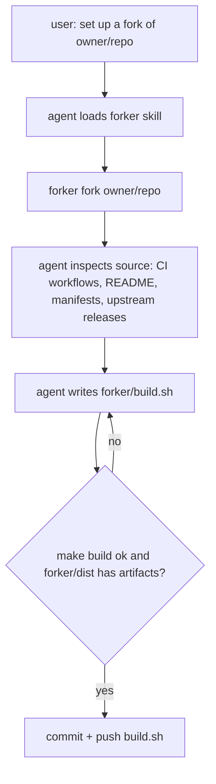
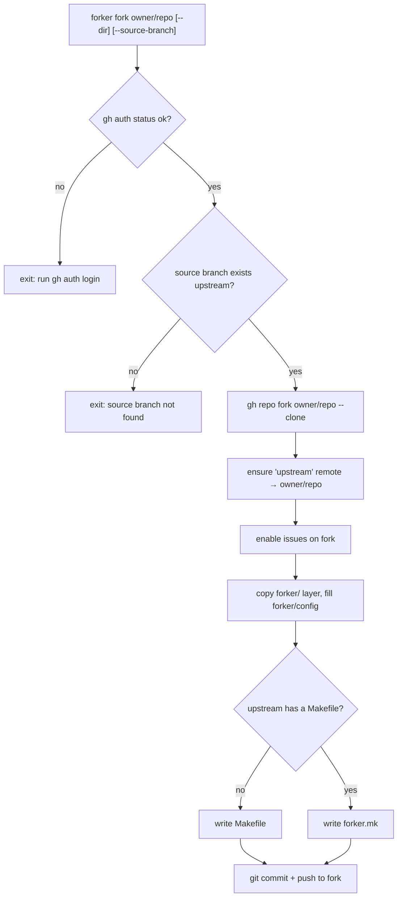
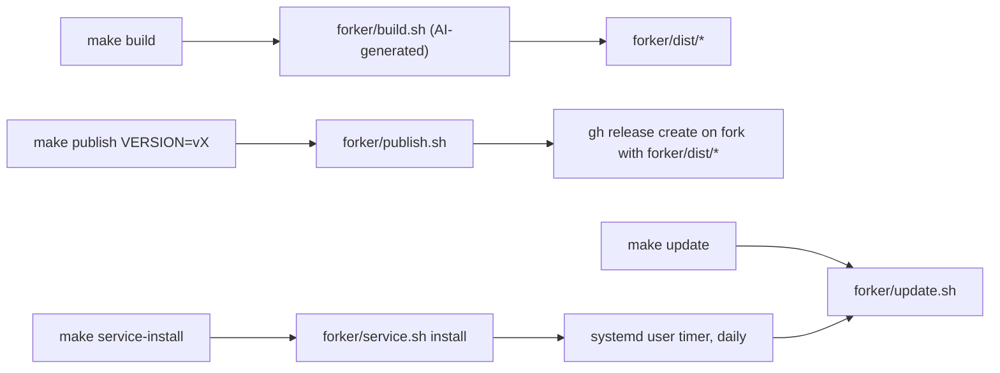
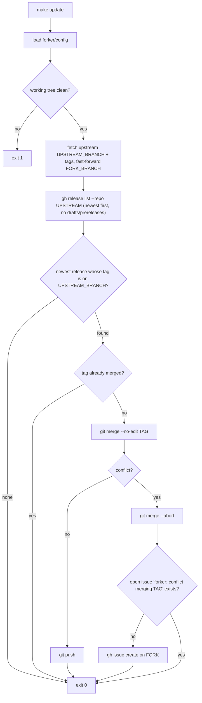
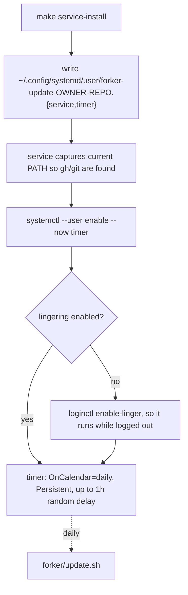

# forker logic

forker splits a fork into two parts:

- a **generic layer**, the same for every repo: Makefile, `forker/config`, `forker/publish.sh`, `forker/update.sh`
- one **project-specific** script, `forker/build.sh`, generated by an AI agent (Claude Code or Codex) through the `forker` skill

## Setup: `forker` skill

## `forker fork <owner/repo>`

## Makefile layer

Use `make -f forker.mk <target>` when the upstream repo already had a Makefile.

## `make update` → `forker/update.sh`

One check per run, no loop and no state file. Run it by hand, or daily via `make service-install`.

Git history is the only state: a release counts as handled once its tag is in `FORK_BRANCH`.
Releases whose tag is not on `UPSTREAM_BRANCH` are ignored, so a fork can follow e.g. `release/1.x`.
Rerunning after a conflict finds the open issue, so no duplicate issue gets created.
Everything forker adds lives in `forker/` (plus the Makefile), so upstream merges rarely conflict with it.

## Daily service → `forker/service.sh`

`make service-status` shows the next run and recent logs. `make service-uninstall` removes the units.
`bash forker/service.sh run` triggers a run immediately.
