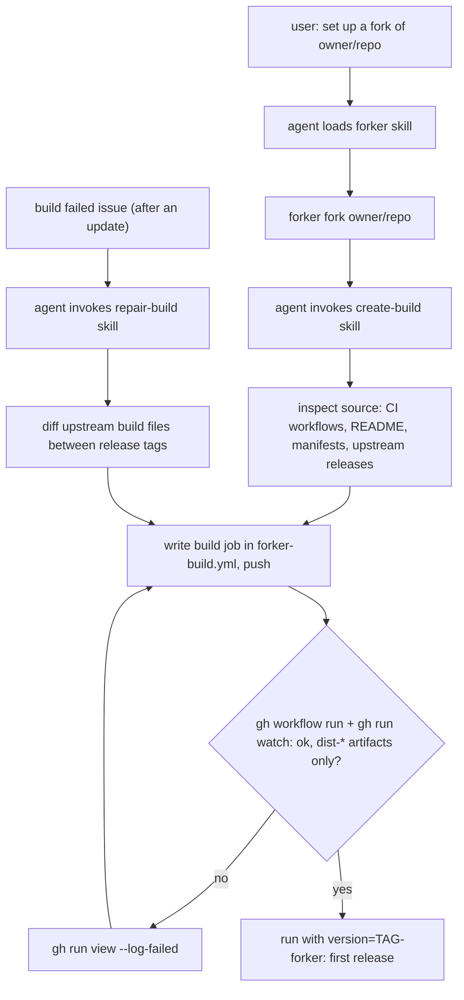
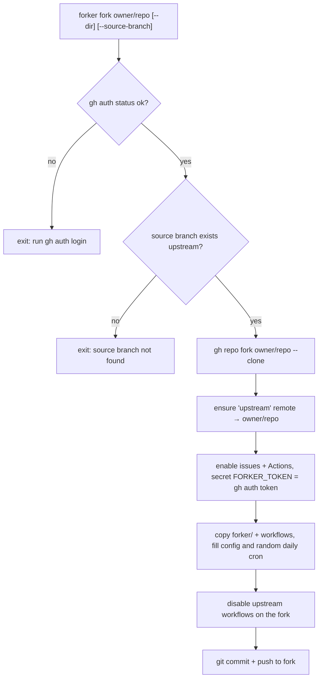
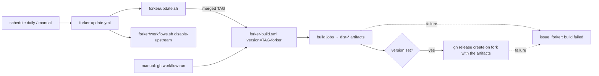
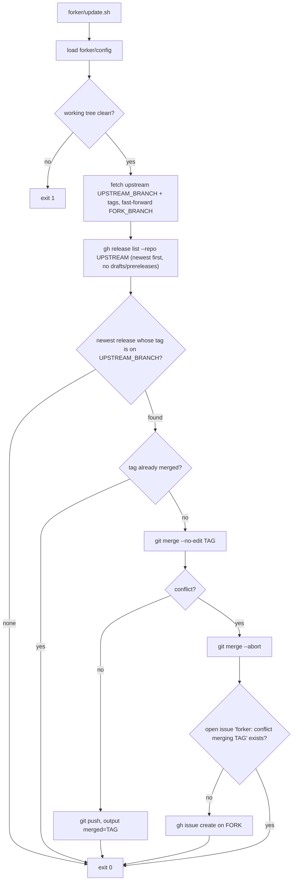

# forker logic

forker splits a fork into two parts:

- a **generic layer**, the same for every repo: `.github/workflows/forker-update.yml`, the `publish` and `report` jobs of `forker-build.yml`, `forker/config`, `forker/update.sh`, `forker/workflows.sh`
- one **project-specific** part, the `build` job(s) in `.github/workflows/forker-build.yml`, written by an AI agent (Claude Code or Codex) through the `create-build` skill (called by the `forker` skill), and fixed by `repair-build`

Everything runs on GitHub Actions; nothing needs to run locally after setup.

## Setup: `forker` skill

## `forker fork <owner/repo>`

## GitHub Actions

The update workflow dispatches the build with `gh workflow run`, because pushes don't trigger other workflows reliably and the build must know the version.
Release tags get a `-forker` suffix, since the fork already carries upstream's tags pointing at upstream commits.

## `forker/update.sh`

One check per run, no loop and no state file. Runs in `forker-update.yml`, or by hand in a clone.

Git history is the only state: a release counts as handled once its tag is in `FORK_BRANCH`.
Releases whose tag is not on `UPSTREAM_BRANCH` are ignored, so a fork can follow e.g. `release/1.x`.
Rerunning after a conflict finds the open issue, so no duplicate issue gets created.
Everything forker adds lives in `forker/` and `.github/workflows/forker-*.yml`, so upstream merges rarely conflict with it.
